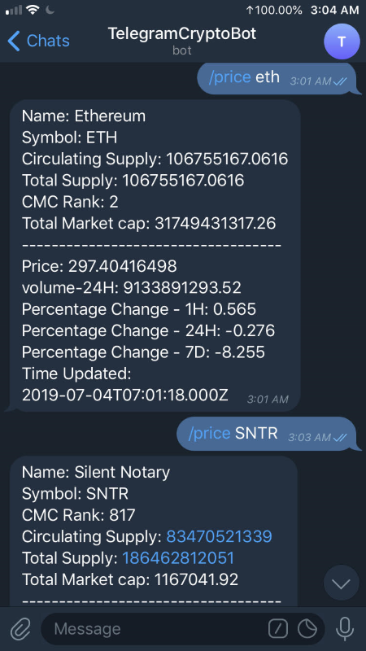

# TelegramCryptoBot
A lightweight Cryptocurrency information grabber for Telegram using Python

# Usage 
Run the bot while filling both the Coinmarketcap key as well as the Telegram bot key in the external txt file

The only command currently is /price (coin symbol)

# Depiction

