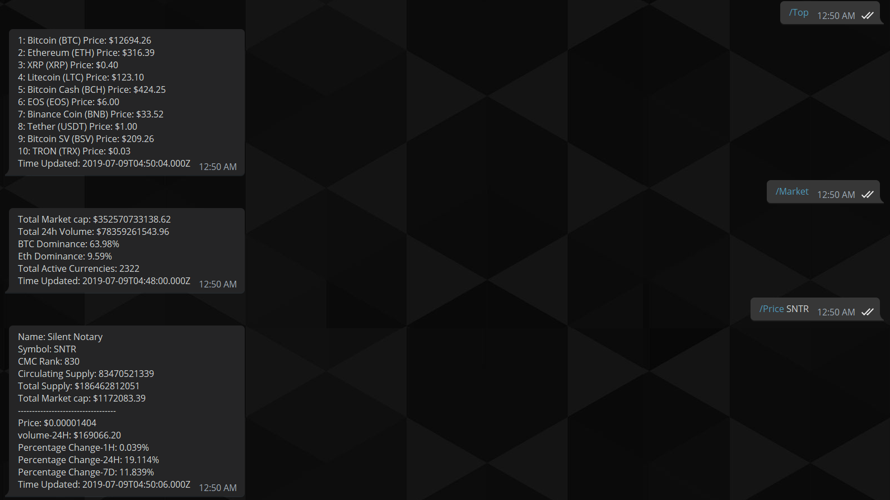

# TelegramCryptoBot
A lightweight Cryptocurrency information grabber for Telegram using Python

# Usage 
Run the bot while filling both the Coinmarketcap key as well as the Telegram bot key in the external txt file

# Commands
/Price (Coin symbol) - Displays current price and statistics of the coin selected

/Top - Displays the ranking and prices of the top 10 cryptocurrencies

/Market - Displays total market statistics

/Help - Presents a list of the menu options

# Current Plans
Currently I have put into place a cooldown that will only allow commands every 20 seconds. Unfortunatly the bot still registers user requests and will persue them after the 20 seconds are up. I'd like to make a proper cooldown that will also ignore requests during the 20 seconds.

# Depiction

